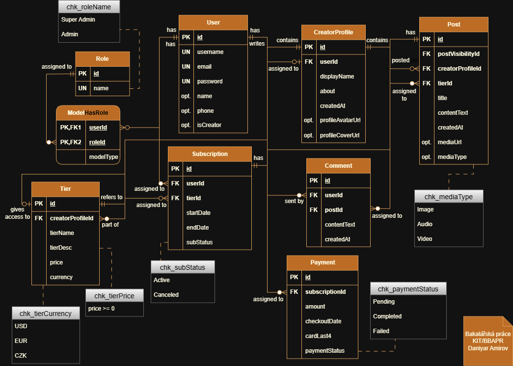

# BlogHub – Webová platforma pro podporu tvůrců obsahu

Projekt představuje implementaci webové platformy umožňující tvůrcům digitálního obsahu (creators) publikovat svůj obsah (content) a získávat podporu formou předplatného (subscription) (<a href='https://www.patreon.com/explore' target='_blank'>Patreon</a>-like model) od svých sledujících podporovatelů (supporters).

Projekt je rozdělen na backend (**Laravel** + **Filament**) a frontend (**React**) a je postaven na **Docker** kontejnerech (tj. dockerizovaný).

---

## 🎥 Demo

> Krátká demonstrace aplikace:

[](https://youtu.be/VIDEO_URL)

---

## 🛠️ Nástroje a technologie


---

## 📁 Adresářová struktura

```
bloghub/
├── backend/
│   ├── app/
│   │   ├── Enums/
│   │   ├── Filament/
│   │   │   ├── Pages/
│   │   │   └── Resources/
│   │   ├── Http/
│   │   │   ├── Controllers/
│   │   │   └── Requests/
│   │   ├── Models/
│   │   ├── Policies/
│   │   ├── Providers/
│   │   └── Rules/
│   ├── bootstrap/
│   ├── config/
│   ├── database/
│   │   ├── factories/
│   │   ├── migrations/
│   │   └── seeders/
│   ├── public/
│   ├── resources/
│   ├── routes/
│   │   ├── api.php
│   │   ├── console.php
│   │   └── web.php
│   ├── storage/
│   ├── tests/
│   │   ├── Feature/
│   │   ├── Unit/
│   │   └── TestCase.php
│   ├── .env.example
│   ├── .env.testing.example
│   ├── composer.json
│   ├── Dockerfile
│   ├── entrypoint.sh
│   └── ...
├── docker/
│   ├── mysql/
│   │   └── init/
│   │       └── 01-create-test-db.sql
│   └── nginx/
│       └── backend.conf
├── frontend/
│   ├── public/
│   ├── src/
│   │   ├── assets/
│   │   ├── App.css
│   │   ├── App.tsx
│   │   ├── index.css
│   │   └── main.tsx
│   ├── Dockerfile
│   ├── package.json
│   └── ...
├── imgs/
│   └── bloghub-erd.png
├── docker-compose.yml
└── README.md
```

---

## 🧩 ERD



### 📘 Byznys pravidla

Detailní popis strukturálních (SP) a procedurálních (PP) pravidel, integritních omezení (IO) a vztahů mezi entitami (ERDish věty), je veřejně dostupný v <a href='https://www.notion.so/Pravidla-2f6350f4e44880928288dd7a82e56fac?source=copy_link' target='_blank'>Notion dokumentaci</a>.

---

## 🐳 Docker architektura

Projekt běží v následujících kontejnerech:

| Kontejner               | Popis                   |
|-------------------------|-------------------------|
| `bloghub-mysql`         | MySQL (DB)              |
| `bloghub-backend-php`   | Laravel (backend)       |
| `bloghub-backend-nginx` | Webový server (backend) |
| `bloghub-frontend`      | React (frontend)        |

### Síťová komunikace
- Frontend: http://localhost:5174
- Backend (API): http://localhost:8080
- Admin panel: http://localhost:8080/admin

---

## 🚀 Instalace a spuštění projektu

```bash
> git clone https://github.com/mirroxEkb14/bloghub.git
> cd bloghub/
> docker compose up -d --build
```

**Poznámka №1**: building kontejnerů muže potrvat cca 1,5 minuty, běh skriptu backend kontejneru dalších cca 10-15 vteřin.

**Poznámka №2**: lze narazit na **race condition** kvůli `entrypoint.sh` skriptu, když Filament začne obsluhovat requesty dřív, než doběhnou veškeré migrace a seedery, protože backendový `entrypoint.sh` je nastaven tak, že **PHP-FPM** je spouštěn hned, zatímco migrace a seedery běží na pozadí. Tzn. server už pžijímá requesty, ale DB ještě není připravená.
- `Table 'app.sessions' doesn't exist` (zpřístupnění `/admin`) a `These credentials do not match our records.` (login)

---

## 🔐 Přístup do admin panelu

Výchozí účty (z `.env`):

| Role        | Email                  | Heslo         |
|-------------|------------------------|---------------|
| Super Admin | superadmin@bloghub.cz  | qWerty123456! |
| Admin       | admin@bloghub.cz       | qWerty123456! |

**Poznámka**: běžní uživatelé (user@bloghub.cz) nemají přístup do administrace (`/admin`).

---

## ⚙️ Testing

Testy běží v odděleném testovacím prostředí definovaném v souboru `.env.testing`. Používá se samostatná databáze `app_test`.

Testy lze spustit z kořenového adresáře backendu:
```bash
> php artisan test
```

**Poznámka**: `APP_KEY` v `.env.testing` musí být identický hodnotě tohoto atributu v `.env` (který se generuje automaticky při instalaci kontejnerů).

---

## 🔁 Časté Git scénáře

### ❓ Aktualizace lokálního `main` podle `remote`

```bash
> git checkout main
> git fetch origin
> git pull origin main
```

---

### ❓ Aktualizace lokální větve `fix/default-permissions` podle nových `main` změn

#### Scénář

- Změny lokální větvě `fix/default-permissions` jsou commitnuté jen lokálně (zatím vůbec neexistuje v `remote`).
- `main` má nové commity.

#### Řešení skrz `rebase`

```bash
> git checkout fix/default-permissions
> git fetch origin
> git rebase origin/master
```

Pokud jsou, vyřešit konflikty otevřením příslušných souborů a editací kódu přímo v IDE.

```bash
> git add .
> git rebase --continue
```

---

### ❓ Vyčištění lokálního prostředí po schválenému MR na `remote`

#### Ověření lokální Git historii o `remote` a lokálním repozitářích

```bash
> git branch
> git branch -r
```

### ❓ Číštění lokální Git historii

```bash
> git checkout master
> git fetch origin
> git pull origin master
> git branch -D fix/default-permissions
> git fetch origin --prune
```

### ❓ Zahození celé větve, pro kterou již existuje MR v `remote`

```bash
> git checkout master
> git branch -D fix/default-permissions
> git push origin --delete fix/default-permissions
```

### ❓ Zahození veškerých změn na lokále a up-to-date s `remote`

```bash
> git fetch origin
> git reset --hard origin/master
```

### ❓ Rollback k minulému fungujícímu commitu (když je špatný commit již v `remote`)

```bash
> git log --oneline -10
> git revert <bad_commit_hash>
> git push
```

### ❓ Mázání `.env` souboru z `remote`

```bash
> git rm --cached .env
> git commit -m "Fix: .env from remote removed"
> git push
```

---

## 📬 Kontakty

[](https://github.com/mirroxEkb14)
[](https://gitlab.com/vance_7187)
[](https://www.linkedin.com/in/daniyar-amirov-103467227/)
[](https://t.me/vance_7187)
