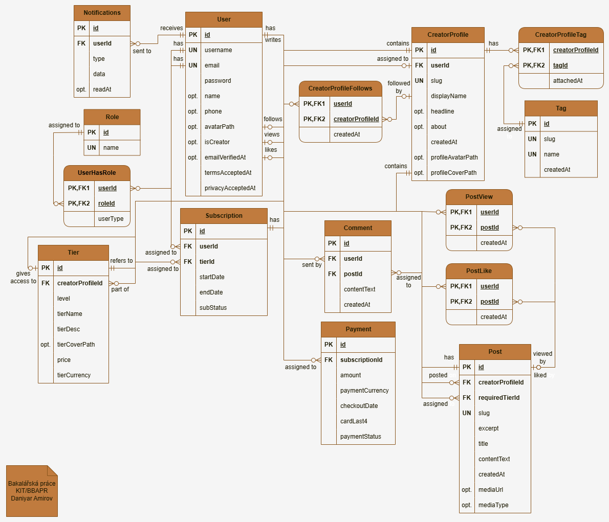

# BlogHub – Webová platforma pro podporu tvůrců obsahu

Projekt představuje implementaci webové platformy umožňující tvůrcům digitálního obsahu (creators) publikovat svůj obsah (content) a získávat podporu formou předplatného (subscription) (<a href='https://www.patreon.com/explore' target='_blank'>Patreon</a>-like model) od svých sledujících podporovatelů (supporters).

Projekt je rozdělen na backend (**MySQL** + **Laravel** + **Filament**) a frontend (**React**) a je postaven na **Docker** kontejnerech (tj. dockerizovaný).

---

## 🎥 Demo

> Krátká demonstrace aplikace:

[](https://youtu.be/DPbAqUDozI0)

---

## 🛠️ Nástroje a technologie


## 📁 Adresářová struktura

```
bloghub/
├── bloghub-backend/
│   ├── app/
│   │   ├── Contracts/
│   │   ├── Enums/
│   │   ├── Filament/
│   │   │   ├── Pages/
│   │   │   ├── Resources/
│   │   │   ├── Schemas/
│   │   │   └── Widgets/
│   │   ├── Filters/
│   │   ├── Http/
│   │   │   ├── Controllers/
│   │   │   ├── Middleware/
│   │   │   ├── Requests/
│   │   │   └── Resources/
│   │   ├── Models/
│   │   ├── Policies/
│   │   ├── Providers/
│   │   │   ├── Filament/AdminPanelProvider.php
│   │   │   ├── AppServiceProvider.php
│   │   │   └── AuthServiceProvider.php
│   │   ├── Rules/
│   │   ├── Services/
│   │   └── Support/
│   ├── bootstrap/
│   ├── config/
│   ├── database/
│   │   ├── factories/
│   │   ├── migrations/
│   │   └── seeders/
│   ├── public/
│   ├── resources/
│   ├── routes/
│   │   ├── api.php
│   │   ├── console.php
│   │   └── web.php
│   ├── storage/
│   ├── tests/
│   │   ├── Feature/
│   │   ├── Unit/
│   │   └── TestCase.php
│   ├── .env.example
│   ├── .env.testing.example
│   ├── composer.json
│   ├── Dockerfile
│   ├── entrypoint.sh
│   └── ...
├── bloghub-frontend/
│   ├── public/
│   ├── src/
│   │   ├── api/
│   │   ├── assets/
│   │   ├── components/
│   │   ├── contexts/
│   │   ├── pages/
│   │   ├── styles/
│   │   ├── utils/
│   │   ├── App.css
│   │   ├── App.tsx
│   │   ├── index.css
│   │   └── main.tsx
│   ├── Dockerfile
│   ├── entrypoint.sh
│   ├── package.json
│   └── ...
├── docker/
│   ├── mysql/
│   │   └── init/
│   │       └── 01-create-test-db.sql
│   └── nginx/
│       └── backend.conf
├── imgs/
│   └── bloghub-erd.png
├── docker-compose.yml
└── README.md
```

---

## 🧩 ERD



### 📘 Byznys pravidla

Detailní popis strukturálních (SP) a procedurálních (PP) pravidel, integritních omezení (IO) a vztahů mezi entitami (ERD-ish věty), je veřejně dostupný v <a href='https://www.notion.so/Pravidla-2f6350f4e44880928288dd7a82e56fac?source=copy_link' target='_blank'>Notion dokumentaci</a>.

---

## 🐳 Docker architektura

Projekt běží v následujících kontejnerech:

| Kontejner               | Popis                   |
|-------------------------|-------------------------|
| `bloghub-mysql`         | MySQL (DB)              |
| `bloghub-backend-php`   | Laravel (backend)       |
| `bloghub-backend-nginx` | Webový server (backend) |
| `bloghub-frontend`      | React (frontend)        |

### Síťová komunikace
- Frontend: http://localhost:5174
- Admin panel: http://localhost:8080/admin
- Swagger: http://localhost:8080/docs/swagger#/

---

## 🚀 Instalace a spuštění projektu

```bash
> git clone https://github.com/mirroxEkb14/bloghub.git
> cd bloghub/
> docker compose up -d --build
```

**Poznámka №1**: za pomoci `entrypoint.sh` automaticky bude vygenerován `.env` s daty z `.env.example` (stejně tak i **APP_KEY** při prvním buildu; pro funkci testů tato stejná hodnota musí být manuálně zkopírována do `.env.testing`). Pak je potřeba nastavit hodnoty pro určité proměnné prostředí, aby bylo možné používat veškeré features:
- Email verifikace: **MAIL_USERNAME**, **MAIL_PASSWORD**, **MAIL_FROM_ADDRESS**.
- Stripe: **STRIPE_KEY**, **STRIPE_SECRET**, **STRIPE_WEBHOOK_SECRET**.

**Poznámka №2**: lze narazit na **race condition** kvůli `entrypoint.sh` skriptu, když server začne přijímat requesty, ale DB ještě není připravená.
- `Table 'app.sessions' doesn't exist` (zpřístupnění skrz `/admin`) a `These credentials do not match our records.` (login).

---

## 💸 Stripe

Pro simulaci procesu plateb projekt používá platební bránu  <a href='https://stripe.com/en-cz'>Stripe</a> v testovacím režimu. Obecný návod na připojení Stripu je:
- Zaregistrovat se na stránkách Stripu a přejít do <a href='https://dashboard.stripe.com/'>Dashboardu</a>.
- Zkopírovat <b>Publishable key</b> a <b>Secret key</b> do `.env` souboru a uložit do příslušných proměnných prostředí (<b>STRIPE_KEY</b> a <b>STRIPE_SECRET</b>):
    - (kdyby klíče nebyly dostupné na dashboard stránce, tak v záložce <b>Developers</b> -> <b>API keys</b>),
    - z dashboardu přejít do <b>Developers</b> -> <b>Webhooks</b> -> <b>Add destination</b>:
        - API version: `.clover`,
        - Events: `checkout.session.completed`,
    - <b>Webhook endpoint</b>:
        - Destination name: <b>BlogHub local webhook</b>,
        - Endpoint URL:
            - nainstalovat <a href='https://ngrok.com/download/windows'>ngrok</a> a zaregistrovat se e-mailem,
            - umístit `ngrok.exe` do `C:\ngrok-v3` adresáře,
            - volitelně, lze přidat tuto cestu do Proměnných Prostředí ve Windows,
            - otevřit .exe a zadat <b>Authtoken</b> z <a href='https://dashboard.ngrok.com/'>ngrok dashboardu</a>:
            ```bash
            ngrok config add-authtoken $YOUR_AUTHTOKEN
            ```
            - spustit ngrok a zkopírovat public URL (`https://...ngrok-free.dev`) z řádku <b>Forwarding</b>:
            ```bash
            ngrok http 8080
            ```
            - přidat <b>POST</b> endpoint z kontrolleru (`/api/webhooks/stripe`):
            - `https://...ngrok-free.dev/api/webhooks/stripe`
        - Description (optional): <b>Local dev – checkout.session.completed</b>
    - ze stránky nově vytveřeného Destination, zkopírovat <b>Signing secret</b> (`whsec_`) a uložit do <b>STRIPE_WEBHOOK_SECRET</b>.

<b>Poznámka №1</b>: na stránce `checkout.stripe.com` se pak používá jedna z testovacích Stripe karet, tj. <b>4242 4242 4242 4242</b>. Seznam veškerých karet lze nalézt na stránkách <a href='https://docs.stripe.com/testing'>Stripe Docs</a>.

<b>Poznámka №2</b>: platby nebudou procházet v případě, že <b>(i)</b> <b>Destination</b> je vypnut ve Stripe dashboardu, <b>(ii)</b> není vytnořen zabezpečený tunel v příkazovém řádku ngrok.

---

## 📧 E-mail verifikace

V současné (07.03.2026) implementaci projekt využívá e-mailové verifikace. Pro testování této logiky je potřeba:
1. Vytvořit **App Password** pro Google účet, odkud budou posílány e-mailové zprávy:
    - **Google Account** -> **Security & sign-in** -> **App passwords**.
    - **Poznámka**: Aby Google pustil do sekce Hesel aplikací, musí být zapnuto **2-Step Verification**.
2. Zadat e-mailovou adresu a dát vygenerované 16mistné heslo do příslušných proměnných prostředí v `.env`:
    - `MAIL_USERNAME`, `MAIL_PASSWORD` a `MAIL_FROM_ADDRESS`.

---

## 🔐 Přístup do admin panelu

Výchozí účty (z `/config/seed.php`):

| Role        | Email                  | Heslo         |
|-------------|------------------------|---------------|
| Super Admin | superadmin@bloghub.cz  | qWerty123456! |
| Admin       | admin@bloghub.cz       | qWerty123456! |

---

## ⚙️ Testing

Testy běží v odděleném testovacím prostředí definovaném v souboru `.env.testing`. Používá se samostatná databáze `app_test`.

Testy lze spustit z kořenového adresáře `bloghub/` uvnitř konteknerů:
```bash
> docker compose exec backend-php php artisan test
```
```bash
> docker compose exec backend-php php artisan test --testsuite=Feature
```
```bash
> docker compose exec backend-php php artisan test --testsuite=Unit
```

**Poznámka**: `APP_KEY` v `.env.testing` musí být identický hodnotě tohoto atributu v `.env` (který se generuje automaticky při instalaci kontejnerů).

---

## 🗄 Přístup k databázi z konzole

```bash
> docker compose exec mysql mysql -uapp -p
> secret
> show databases;
> use app;
> show tables;
> select * from model_has_roles;
> SELECT u.email, r.name
FROM users u
JOIN model_has_roles mr ON mr.model_id = u.id
JOIN roles r ON r.id = mr.role_id;
> exit
```

---

## 📬 Kontakty

[](https://github.com/mirroxEkb14)
[](https://gitlab.com/vance_7187)
[](https://www.linkedin.com/in/daniyar-amirov-103467227/)
[](https://t.me/vance_7187)
